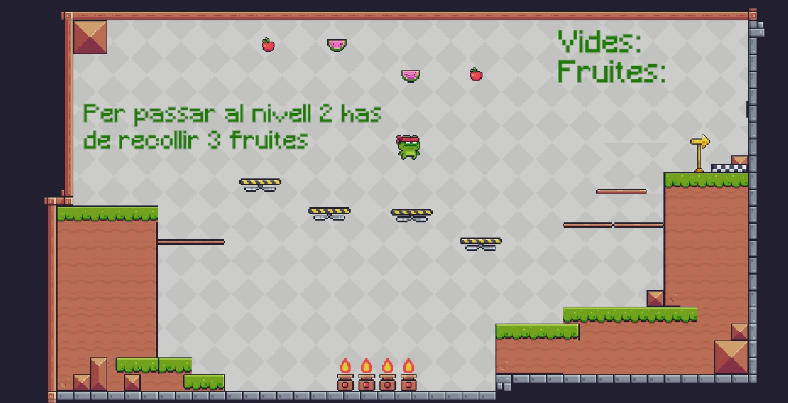

# Joc de plataformes Bàsic

Basat en [Pixel Adventure](https://assetstore.unity.com/packages/2d/characters/pixel-adventure-1-155360) per fer el mapa i els jugadors
## Nivell1
- **Jugador**
  - Animació bàsica asset
  - Moviment bàsic dreta esquerra amb tecles
  - Salt. Només salta quan està tocant el terra(versió simple)
- **Enemic**. Moviment patrulla bàsic dreta esquerra. Gira quan toca Tilemap (detecta col.isió)
- **FaceRock**. Moviment patrulla bàsic amunt i avall entre 2 punts "a piñón"
- **Recol.lecció de fruites**
    - Tenen diferents valors (apple 5pt, síndria 1pt)
    - La poma dóna immunitat
        - canvi de color
        - canvi de mida
        - no mor quan li cau una bomba
- **Canvis d'escena**
   - Associat a botó escena inicial. Codi senzill
   - Associat al punt de canvi de nivell en detectar col.lisió
- **Música de fons** 
- **Fonts** diferents pels botons i missatges (DaFont.com)
- **Tags vs Name** per detectar l'objecte col.lisionat
- **Cauen bombes aleatòriament**
    - Empty object amb un Script per **Crear bomes**
    - Maten el Player si no és inmune. Desapareixen quan toquen el Tilemap
- **Comentaris explicatius**
- **Codi ben estructurat**, ben indentat i fàcil de llegir

## Nivell2
- **Mapa més gran**
- **La càmera segueix el jugador**
- **Spawnpoint**. Quan mor però li queden vides torna al principi
- **Pou**. Si el player cau del mapa mor. Detecta col.lisió amb empty object
- **Intercanvi d'animacions** (transicions). Quan el jugador salta canvia l'animació

## Pantalla Inicial i Pantalla Game Over
- Amb els canvis d'escena corresponents

# To Do
- Fons nivell 2
- Efectes sonors
- Efecte desaparèixer fruites
